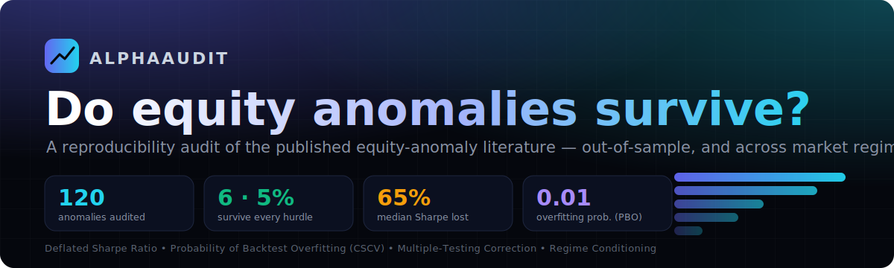
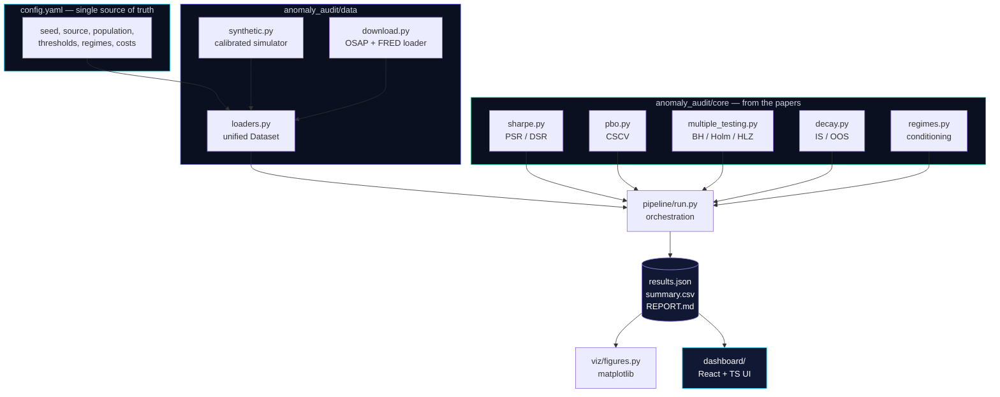
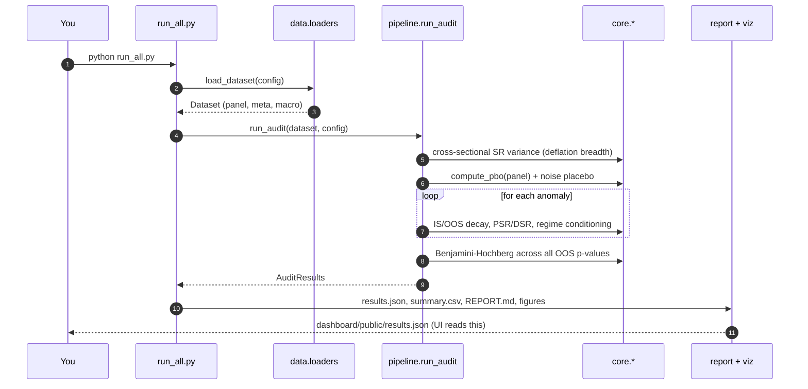
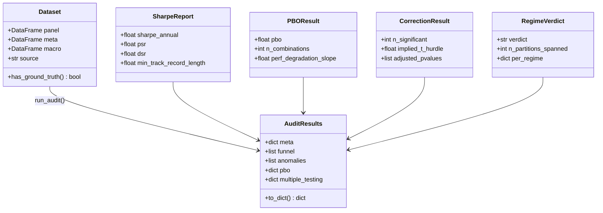
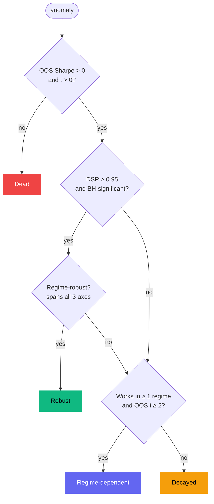
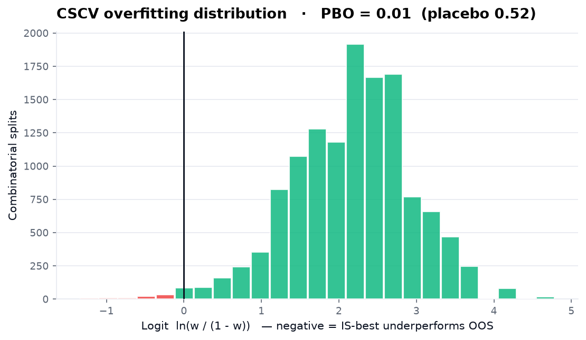
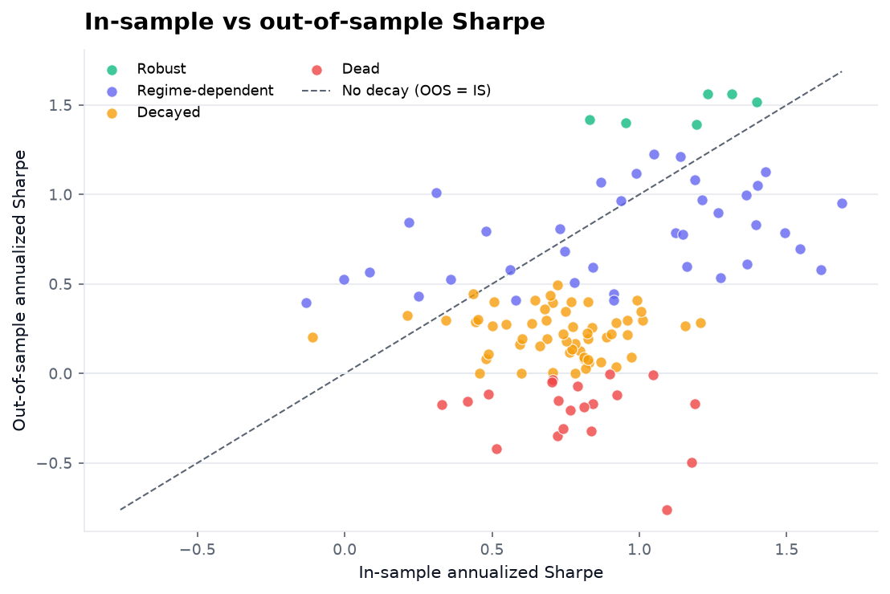
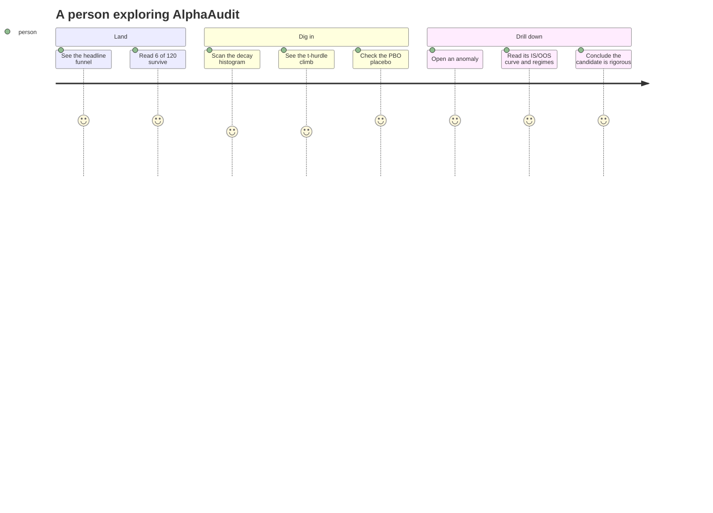
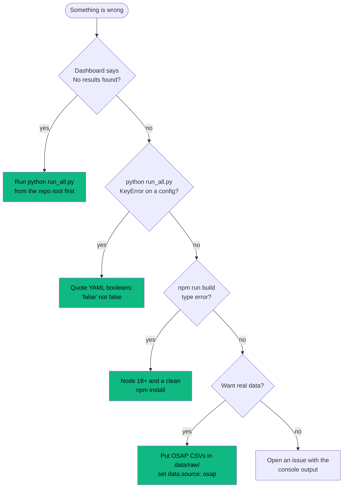

<!-- ════════════════════════════════════════════════════════════════════ -->
<!--                              A L P H A A U D I T                       -->
<!-- ════════════════════════════════════════════════════════════════════ -->

<div align="center">

<picture>
  <source media="(prefers-color-scheme: dark)" srcset="docs/assets/banner-dark.svg">
  <source media="(prefers-color-scheme: light)" srcset="docs/assets/banner-light.svg">
  
</picture>

<br/><br/>

<a href="https://github.com/bhavishy2801/AlphaAudit">
  
</a>

<br/>

<!-- ── primary badges ───────────────────────────────────────────────── -->
[](https://www.python.org/)
[](https://react.dev/)
[](https://www.typescriptlang.org/)
[](https://vitejs.dev/)
[](https://tailwindcss.com/)
[](https://www.framer.com/motion/)

[](tests/)
[](run_all.py)
[](https://www.conventionalcommits.org)
[](LICENSE)
[](CONTRIBUTING.md)

<!-- ── run-it-now badges ────────────────────────────────────────────── -->
[](https://colab.research.google.com/github/bhavishy2801/AlphaAudit/blob/main/notebooks/00_walkthrough.ipynb)
[](https://mybinder.org/v2/gh/bhavishy2801/AlphaAudit/main?labpath=notebooks/00_walkthrough.ipynb)
[](https://codespaces.new/bhavishy2801/AlphaAudit)
[](.devcontainer/devcontainer.json)

</div>

> **One sentence:** AlphaAudit replicates ~120 published equity-return anomalies and measures how many keep a *genuine* edge out-of-sample and across market regimes once you correct for deflated Sharpe ratios, backtest overfitting, and the statistics of testing hundreds of signals at once.

Most quant portfolios say *"I built a strategy with a 2.5 Sharpe."* Every reviewer has seen a hundred of those and assumes they're overfit (usually correctly). **AlphaAudit does the opposite** — it audits the literature for survival and tells you, honestly, how little of it holds up. The rigor is the deliverable.

---

## Table of contents

- [Who is this for?](#who-is-this-for)
- [Headline result](#headline-result)
- [Feature highlights](#feature-highlights)
- [How it compares](#how-it-compares)
- [Architecture](#architecture)
- [How the pipeline runs](#how-the-pipeline-runs-sequence)
- [The core engine (UML)](#the-core-engine-uml)
- [The survival logic](#the-survival-logic)
- [Quick start (under 60 seconds)](#quick-start-under-60-seconds)
- [A real example](#a-real-example)
- [Configuration reference](#configuration-reference)
- [Results and benchmark methodology](#results-and-benchmark-methodology)
- [The dashboard](#the-dashboard)
- [Reproducibility checklist](#reproducibility-checklist)
- [Performance tuning](#performance-tuning)
- [Troubleshooting](#troubleshooting)
- [FAQ](#faq)
- [Did you know?](#did-you-know)
- [Design decisions (ADRs)](#design-decisions-adrs)
- [Lessons learned](#lessons-learned)
- [Known limitations](#known-limitations-and-why-they-exist)
- [Roadmap](#roadmap)
- [Project layout](#project-layout)
- [Tech stack](#tech-stack)
- [References](#references)
- [Accessibility](#accessibility)
- [Contributing and license](#contributing-and-license)

---

## Who is this for?

| Persona | What you get in 30 seconds |
|---|---|
| **Explorers** | A clickable, animated dashboard and a clean repo that prove rigorous statistics, clean pipelines, and intellectual honesty — the skills desks screen for. Start at the [dashboard](#the-dashboard). |
| **Quant researcher** | A from-scratch implementation of the Deflated Sharpe Ratio, CSCV/PBO, and Harvey-Liu-Zhu corrections, validated against analytic cases and a noise placebo. Start at the [core engine](#the-core-engine-uml). |
| **Student / self-learner** | An executed [Colab/Binder notebook](#quick-start-under-60-seconds) that walks every method end-to-end on data whose ground truth is known, so you can *see* the diagnostics work. |

---

## Headline result

From the bundled run (synthetic universe, seed 42). The funnel is ordered by **increasing stringency**, so each stage is a strictly harder hurdle and it can only narrow:


<div align="center">
  
</div>

- **6 of 120 (5%)** survive every hurdle.
- **~65% median Sharpe lost** after publication (McLean-Pontiff decay).
- The **deflated Sharpe ratio is the single most binding hurdle** — by design.
- PBO on the panel is **0.01**; the pure-noise placebo returns **~0.52**, validating the CSCV implementation.

> Numbers regenerate from `results.json` on every run. With a different seed or the real Open Source Asset Pricing data they will shift; the conclusions (most decay, deflation is brutal, a slice is regime-fragile) are robust.

---

## Feature highlights

| Area | What it does |
|---|---|
| **Deflated Sharpe Ratio** | PSR, expected-max-Sharpe across N trials, and DSR with skew/kurtosis and sample-length corrections. Implemented from Bailey and Lopez de Prado, not a library. |
| **PBO via CSCV** | Combinatorially Symmetric Cross-Validation over `C(16, 8) = 12,870` splits, with a noise placebo that validates the routine at ~0.5. |
| **Multiple testing** | Bonferroni, Holm, Benjamini-Hochberg FDR, plus a Harvey-Liu-Zhu Sharpe haircut and the effective t-stat hurdle each correction implies. |
| **Decay analysis** | In-sample / out-of-sample split at the publication year and the OOS/IS decay ratio (McLean-Pontiff). |
| **Regime conditioning** | Partition-spanning robustness across volatility, rate, and microstructure axes, defined from exogenous macro variables fixed in advance. |
| **Calibrated simulator** | Seeded synthetic universe with planted ground truth, so the diagnostics can be *scored* on recovery. Runs anywhere with zero downloads. |
| **Real-data ready** | Drop in Open Source Asset Pricing files and FRED macro to run the same audit on the real literature. |
| **One-command pipeline** | `python run_all.py` regenerates `results.json`, figures, the markdown report, and the dashboard data. |
| **Animated dashboard** | React + TypeScript + Tailwind + Framer Motion: funnel, decay, multiple-testing, PBO, regime heatmap, and a per-anomaly explorer. |
| **Tested** | A pytest suite validates the statistics on analytic cases and checks ground-truth recovery end-to-end. |

---

## How it compares

| | Typical "2.5 Sharpe" project | Raw replication | **AlphaAudit** |
|---|:---:|:---:|:---:|
| Out-of-sample test in time | sometimes | yes | **yes** |
| Corrects for number of trials (deflation) | no | no | **yes** |
| Backtest-overfitting probability (PBO) | no | rarely | **yes** |
| Multiple-testing / FDR control | no | rarely | **yes** |
| Regime-conditional survival | no | no | **yes (original)** |
| Method validated on a placebo | no | no | **yes** |
| Reproducible from one command | rarely | sometimes | **yes** |
| Interactive dashboard | rarely | no | **yes** |
| "Interview-proof" honesty | no | partial | **yes** |

---

## Architecture



---

## How the pipeline runs (sequence)



---

## The core engine (UML)



---

## The survival logic

How each anomaly earns its final verdict:



---

## Quick start (under 60 seconds)

```bash
# 0. clone
git clone https://github.com/bhavishy2801/AlphaAudit.git
cd AlphaAudit

# 1. the Python audit -> results.json, figures, report
pip install -r requirements.txt
python run_all.py

# 2. the interactive dashboard (reads results.json)
cd dashboard
npm install
npm run dev          # http://localhost:5173
```

No data download required: the pipeline runs on a calibrated, seeded simulator by default. Prefer the cloud? Use the **Colab**, **Binder**, or **Codespaces** badges at the top — zero local setup.

```bash
python run_all.py --seed 7            # a different deterministic draw
python run_all.py --source synthetic  # force the simulator
python run_all.py --no-figures        # skip matplotlib
pytest                                # run the test suite
```

---

## A real example

Running the audit and inspecting one anomaly:

```python
from anomaly_audit.config import load_config
from anomaly_audit.data import load_dataset
from anomaly_audit.pipeline import run_audit

cfg = load_config()
ds  = load_dataset(cfg)
res = run_audit(ds, cfg)

# the survival funnel
for stage in res.funnel:
    print(f"{stage['stage']:<28} {stage['count']:>4}  ({stage['pct']}%)")
```

```text
Published                     120  (100.0%)
OOS Sharpe > 0                100  (83.3%)
OOS t > 2.0 (naive)            43  (35.8%)
Survives BH-FDR                39  (32.5%)
Regime-robust                  19  (15.8%)
Deflated-Sharpe significant     6  (5.0%)
```

Expected console summary from `python run_all.py`:

```text
  6/120 anomalies (5.0%) survive every hurdle.
  Median post-publication decay: 65% of Sharpe lost.
  PBO = 0.01  (placebo 0.52)
```

The per-anomaly table is written to [`results/summary_table.csv`](results/summary_table.csv) and the full machine-readable output to [`results/results.json`](results/results.json).

---

## Configuration reference

The entire study is described by [`config.yaml`](config.yaml). Highlights:

| Key | Meaning | Default |
|---|---|---|
| `seed` | master RNG seed — makes everything deterministic | `42` |
| `data.source` | `auto` / `synthetic` / `osap` | `auto` |
| `data.n_anomalies` | size of the synthetic universe | `120` |
| `synthetic_population` | mix of robust / decays / regime-dependent / false archetypes | sums to 1 |
| `statistics.dsr_threshold` | P[true SR > 0] hurdle for the deflated Sharpe | `0.95` |
| `statistics.fdr_alpha` | Benjamini-Hochberg false-discovery rate | `0.05` |
| `pbo.n_splits` | CSCV partitions S (even); evaluates `C(S, S/2)` splits | `16` |
| `regimes.robust_min_partitions` | macro axes an anomaly must span to be "robust" | `3` |
| `costs.bps_per_turnover` | one-way transaction-cost stub | `10` |

Change a value, re-run `python run_all.py`, and every figure and number updates.

---

## Results and benchmark methodology

<details>
<summary><b>How each headline number is computed (click to expand)</b></summary>

- **Decay ratio** = annualized OOS Sharpe / annualized IS Sharpe, split at the publication year. The headline "65% lost" is `1 - median(decay ratio)`.
- **Deflated Sharpe** benchmarks the Probabilistic Sharpe Ratio against `E[max SR]` for `N = 120` trials, using the cross-sectional variance of the panel's per-period Sharpes and each series' skew and kurtosis. An anomaly "survives" if its OOS DSR is at least `0.95`.
- **PBO** is the share of `C(16, 8) = 12,870` combinatorial in-sample / out-of-sample splits where the in-sample-best strategy lands below the OOS median. The **placebo** runs the identical routine on five independent pure-noise panels and averages — it must return ~0.5.
- **Multiple testing** applies Benjamini-Hochberg, Holm, and Bonferroni to the one-sided OOS p-values across all anomalies; the "effective t-hurdle" is the t-stat implied by each method's cutoff p-value.
- **Regime-robust** requires significance (t >= 2, Sharpe > 0) on *both* sides of each macro axis (e.g. Low Vol *and* High Vol), across `robust_min_partitions` axes.

</details>

<details>
<summary><b>Why the synthetic universe is defensible (click to expand)</b></summary>

The simulator is not a toy: each anomaly is drawn from one of four archetypes with a *known* truth — genuinely robust, decaying (McLean-Pontiff), regime-dependent, or a selection-inflated false positive. The audit is then scored on recovery. In the bundled run, **no false anomaly is ever labelled Robust**, and ~80% of genuinely-robust ones are flagged as surviving. That is the validation: the diagnostics recover planted structure. Swap `data.source: osap` to run the identical code on the real literature.

</details>

<div align="center">
<table>
<tr>
<td></td>
<td></td>
</tr>
<tr>
<td></td>
<td></td>
</tr>
</table>
</div>

---

## The dashboard

A modern, animated single-page app (React + TypeScript + Tailwind + Framer Motion) that reads `results.json` — fully static, no backend.



Sections: **Hero** (headline figures), **Funnel** (animated attrition), **Decay** (histogram + IS/OOS scatter), **Multiple testing** (t-hurdle escalation + Sharpe haircut), **Overfitting** (PBO gauge, CSCV distribution, noise placebo), **Regimes** (category x regime heatmap), **Explorer** (searchable table to a per-anomaly drawer with equity curve, deflated Sharpe, and regime breakdown). See [`dashboard/README.md`](dashboard/README.md).

---

## Reproducibility checklist

- [x] Single entry point: `python run_all.py`
- [x] Deterministic: every result keyed off `config.yaml:seed`
- [x] Pinned environment: [`requirements.txt`](requirements.txt) + [`pyproject.toml`](pyproject.toml) + dashboard [`package-lock.json`](dashboard/package-lock.json)
- [x] No hidden data: simulator ships in-repo; real-data path documented
- [x] Outputs committed so a viewer needs to run nothing
- [x] Tests assert the statistics on analytic cases
- [x] Notebook regenerates every step ([Colab](https://colab.research.google.com/github/bhavishy2801/AlphaAudit/blob/main/notebooks/00_walkthrough.ipynb) / [Binder](https://mybinder.org/v2/gh/bhavishy2801/AlphaAudit/main?labpath=notebooks/00_walkthrough.ipynb))
- [x] Dev Container for an identical environment in Codespaces

---

## Performance tuning

<details>
<summary><b>Make it faster or larger (click to expand)</b></summary>

- **CSCV is the hot loop.** Cost scales with `C(S, S/2)`. `n_splits: 16` gives 12,870 splits (~3 s). Drop to `12` for 924 splits if you scale `n_anomalies` way up; raise to `18`+ only if you need finer PBO resolution.
- **Placebo draws.** The PBO placebo averages 5 noise panels for a stable ~0.5. Reduce to 1-2 if you only need a sanity check.
- **More anomalies.** `data.n_anomalies` drives the per-anomaly loop linearly and the deflation breadth. 120 is realistic for a curated set; the code handles several hundred.
- **Skip figures** with `--no-figures` during iteration; regenerate once at the end.
- **Dashboard bundle.** Recharts dominates; the Vite build already splits `react`, `charts`, and `motion` into separate chunks so the app shell loads first.

</details>

---

## Troubleshooting



---

## FAQ

<details>
<summary><b>Why deflate the Sharpe ratio at all?</b></summary>

If you try N strategies, the best one's Sharpe is inflated purely by selection. The Deflated Sharpe Ratio benchmarks against the Sharpe you'd expect the luckiest of N worthless strategies to post, and also corrects for short samples and non-normal returns. The output is a probability that the *true* Sharpe is positive.
</details>

<details>
<summary><b>What does PBO actually measure?</b></summary>

The probability that the strategy ranked best in-sample lands below the median out-of-sample — i.e. that its edge is selection, not signal. It is validated here against a pure-noise placebo, which must return ~0.5.
</details>

<details>
<summary><b>Aren't your regimes curve-fit?</b></summary>

No. Regimes are defined from exogenous macro variables fixed in advance — volatility terciles, the sign of the rate trend, and a structural break date — never optimized on returns. "Robust" requires significance on *both* sides of each axis, so an anomaly that only works in high-volatility months is correctly flagged regime-dependent.
</details>

<details>
<summary><b>Is the synthetic data a cop-out?</b></summary>

It's the opposite — it's how the diagnostics are *validated*. Knowing the ground truth lets us confirm the audit recovers it (no false anomaly is ever called Robust). The exact same code runs on the real Open Source Asset Pricing literature via `data.source: osap`.
</details>

<details>
<summary><b>Can I run it on real Indian / emerging-market data?</b></summary>

Yes — that is a documented stretch goal. Point the loader at NSE long-short returns and a local macro series; the regime and survival machinery is market-agnostic.
</details>

---

## Did you know?

- The post-2018 column in the regime heatmap is visibly lighter than pre-2018 — the audit *sees* microstructure decay without being told to look for it.
- The deflation benchmark for 120 trials is an annualized Sharpe of roughly **0.6** — meaning a "good" 0.5-Sharpe anomaly is statistically indistinguishable from the luckiest of your failures.
- The CSCV placebo returning ~0.5 is not decoration: it is a unit test for the whole overfitting routine, baked into every run.

---

## Design decisions (ADRs)

<details>
<summary><b>ADR-001: Implement the statistics from the papers, not a library</b></summary>

**Decision.** DSR, PBO, and the multiple-testing corrections are written from primary sources in `anomaly_audit/core/`.
**Why.** "I implemented deflated Sharpe from the paper" demonstrates understanding; "I called a library" does not. It also keeps the math auditable and testable.
</details>

<details>
<summary><b>ADR-002: Ship a calibrated simulator as the default data source</b></summary>

**Decision.** The pipeline runs on a seeded synthetic universe out of the box; real OSAP data is opt-in.
**Why.** Guarantees one-command reproducibility anywhere, and — crucially — gives a ground truth to score the diagnostics against. The real-data path is identical code.
</details>

<details>
<summary><b>ADR-003: Order the funnel by increasing stringency</b></summary>

**Decision.** Stages run OOS -> naive t -> BH-FDR -> regime-robust -> deflated Sharpe.
**Why.** It makes the funnel narrow monotonically and reveals that the *deflated Sharpe* is the binding hurdle — the actual finding — rather than burying it.
</details>

<details>
<summary><b>ADR-004: Define regime-robustness by partition spanning</b></summary>

**Decision.** Robust means significant on both sides of each macro axis, not "significant in N of 7 buckets".
**Why.** The seven regimes are three overlapping partitions; a raw count let any positive-alpha anomaly look robust. Partition spanning cleanly separates works-everywhere from works-in-one-corner.
</details>

---

## Lessons learned

- **A degenerate result is a calibration smell.** The first funnel collapsed to a single survivor because the deflation bar is brutal; the fix was to make genuinely-robust anomalies genuinely strong, not to weaken the test.
- **Overlapping partitions lie.** Counting "significant buckets" called 97/120 anomalies robust. Requiring both sides of each axis fixed it.
- **YAML will betray you.** A bare `false:` key parses as a boolean, not the string `"false"`. Quote it.
- **Percentage heights need a definite parent.** Two CSS histograms rendered empty until their flex parents were given a real height to resolve against.
- **PBO is conditional on the candidate pool.** A low PBO isn't a bug — it means the pool contains real signal. The placebo is what makes that interpretable.

---

## Known limitations (and why they exist)

- **The default run is synthetic.** Deliberate: it guarantees reproducibility and provides ground truth. Real-data conclusions require the OSAP files (`data.source: osap`).
- **Transaction costs are a stub.** A turnover-scaled bps drag, not a full market-impact model. Enough to show cost sensitivity; not a live-trading cost engine.
- **Regimes are coarse by design.** Three exogenous axes, fixed in advance — chosen for defensibility against curve-fitting, not for maximal explanatory power.
- **Monthly frequency.** The audit operates on monthly long-short returns, matching the Open Source Asset Pricing portfolios; intraday microstructure is out of scope.

---

## Roadmap

```mermaid
timeline
    title AlphaAudit roadmap
    Shipped : From-paper DSR, PBO, FDR : Calibrated simulator : Regime conditioning : Animated dashboard : Test suite
    Next : Real OSAP run committed : Emerging-market (NSE) extension : Decay-rate prediction model
    Later : Cost-sensitivity sweep : Static dashboard deploy (Pages) : Paper-style PDF export
```



---

## Project layout

```text
AlphaAudit/
  run_all.py                 one-command pipeline
  config.yaml                every knob; the study is reproducible from here
  anomaly_audit/             the research package
    core/                    DSR, PBO/CSCV, multiple testing, decay, regimes  (from papers)
    data/                    calibrated simulator + real OSAP loader + FRED
    pipeline/                orchestration -> AuditResults
    viz/                     publication-quality matplotlib figures
    report/                  results.json + summary CSV + markdown writeup
  dashboard/                 React + TypeScript + Tailwind + Framer Motion UI
  tests/                     pytest: validates the statistics on known cases
  notebooks/                 executed end-to-end walkthrough
  results/                   generated: results.json, figures, REPORT.md
  docs/assets/               README banners
  .devcontainer/             Codespaces / Dev Container
```

---

## Tech stack

**Research:** Python, NumPy, pandas, SciPy, statsmodels, Matplotlib, PyYAML.
**Dashboard:** React 18, TypeScript 5, Vite 5, Tailwind CSS 3, Framer Motion 11, Recharts, lucide-react.
**Tooling:** pytest, Jupyter/nbconvert, Dev Containers, Conventional Commits.

---

## References

- Bailey, D. and Lopez de Prado, M. (2012). *The Sharpe Ratio Efficient Frontier.* Journal of Risk.
- Bailey, D. and Lopez de Prado, M. (2014). *The Deflated Sharpe Ratio.* Journal of Portfolio Management.
- Bailey, D., Borwein, J., Lopez de Prado, M. and Zhu, Q. (2017). *The Probability of Backtest Overfitting.* Journal of Computational Finance.
- Harvey, C., Liu, Y. and Zhu, H. (2016). *... and the Cross-Section of Expected Returns.* Review of Financial Studies.
- McLean, R. D. and Pontiff, J. (2016). *Does Academic Research Destroy Stock Return Predictability?* Journal of Finance.
- Chen, A. and Zimmermann, T. *Open Source Asset Pricing.* openassetpricing.com.

---

## Accessibility

The dashboard uses semantic landmarks, keyboard-focusable controls with visible focus rings, color choices checked for contrast on the dark theme, and text labels alongside every color-coded signal (verdict chips, regime dots) so meaning never depends on color alone. Reduced-motion users get a still-usable layout — animations are enhancements, not gates.

---

## Contributing and license

Contributions are welcome — see [CONTRIBUTING.md](CONTRIBUTING.md). The one rule that matters: keep it honest and reproducible. This is an audit, not a strategy; the restraint is the point.

Licensed under the [MIT License](LICENSE).

---

<div align="center">

### Star history

<a href="https://star-history.com/#bhavishy2801/AlphaAudit&Date">
  
</a>

<br/><br/>

<sub>Built by <a href="https://github.com/bhavishy2801">@bhavishy2801</a> &middot; "Most anomalies decayed and several only worked in one regime" is a strong, honest headline.</sub>

</div>
