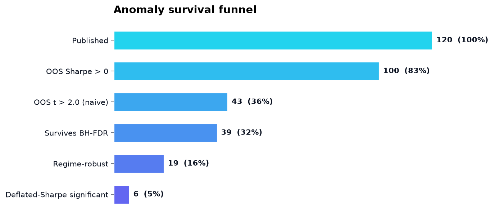
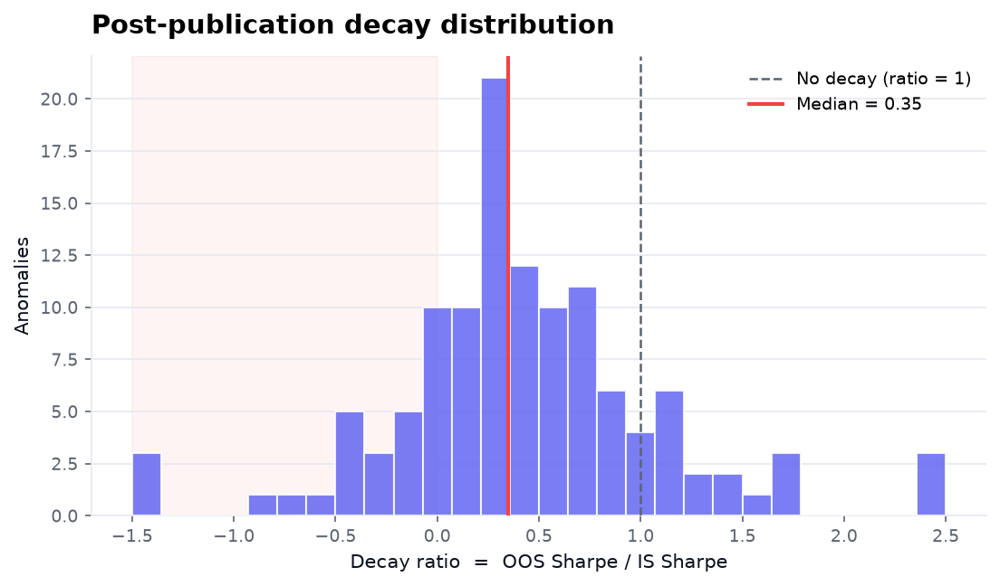
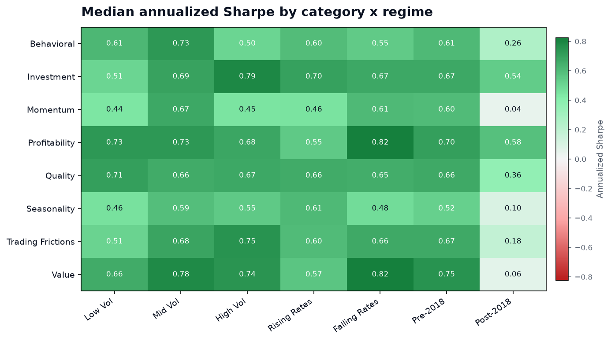

# Do Published Equity Anomalies Survive Out-of-Sample and Across Market Regimes?

*A reproducibility audit with deflated Sharpe ratios and overfitting diagnostics.*

>**Auto-generated from `results.json`.** Data source: **synthetic** · 120 anomalies · 1965-01 to 2024-12 (720 months) · seed 42.

## Headline finding

Of **120 published anomalies**, **6 (5.0%)** clear every hurdle- positive out-of-sample, naive significance, Benjamini-Hochberg multiple-testing control, robustness across macro regimes, and a deflated Sharpe ratio that survives the selection adjustment for 120 trials. The median anomaly lost **64.9%** of its Sharpe after publication.

## The survival funnel

| Stage | Surviving | % of universe |
|---|---:|---:|
| Published | 120 | 100.0% |
| OOS Sharpe>0 | 100 | 83.3% |
| OOS t>2.0 (naive) | 43 | 35.8% |
| Survives BH-FDR | 39 | 32.5% |
| Regime-robust | 19 | 15.8% |
| Deflated-Sharpe significant | 6 | 5.0% |



## Post-publication decay (McLean-Pontiff)

- Median decay ratio (OOS Sharpe/IS Sharpe): **0.35**
- Share of anomalies that lost>50% of their Sharpe: **60.0%**



## Multiple testing

- Anomalies clearing the naive `t>2.0` bar: **43**
- Surviving Benjamini-Hochberg FDR control (alpha=0.05): **39** (effective t-hurdle ~ **2.41**)
- Surviving Bonferroni: **24** (effective t-hurdle ~ **3.62**)
- Median Harvey-Liu-Zhu Sharpe haircut: **5.7%**

## Probability of Backtest Overfitting (CSCV)

- PBO on the published panel: **0.01** over 12870 combinatorial splits
- PBO on a pure-noise placebo (validation): **0.52** (theory says ~0.50)
- Performance-degradation slope (OOS vs IS of the selected strategy): **-0.37**



## Verdict breakdown

| Verdict | Count |
|---|---:|
| Robust | 6 |
| Regime-dependent | 37 |
| Decayed | 57 |
| Dead | 20 |

>Because this run used the calibrated synthetic universe, the audit's verdicts can be checked against the planted ground truth- see `results.json->summary.ground_truth_counts` and the confusion matrix in the notebook.

## Reproduce

```bash
python run_all.py   # regenerates results.json, this report and every figure
```
